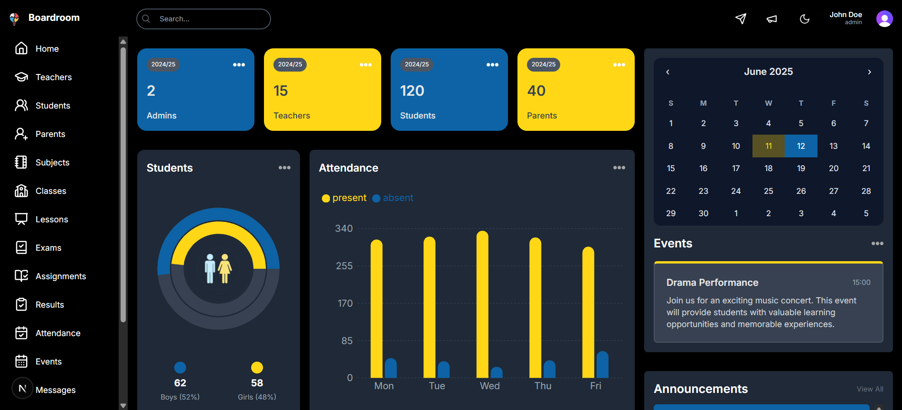
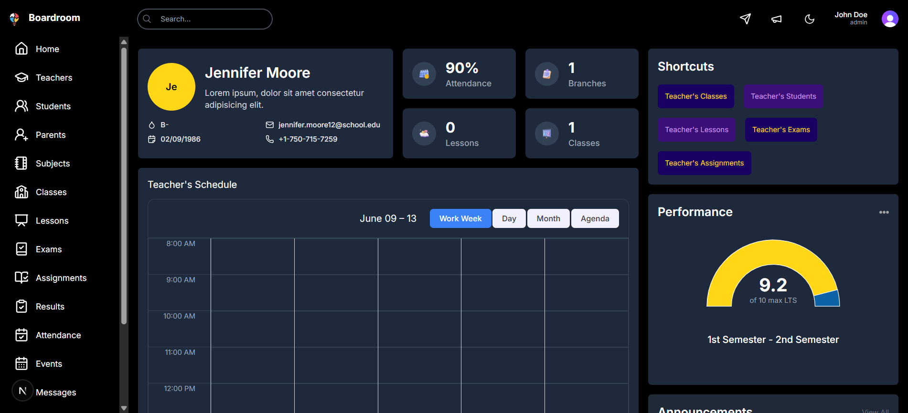

# 🏛 Boardroom – Academic Management Platform  
🌍 A full-featured, web-based platform for managing educational institutions, built to enhance academic administration and streamline communication. Boardroom brings together personalized dashboards, secure role-based access, and modular tools to support assignment tracking, examination schedules, and institution-wide announcements.  
✨Access the [live site](https://boardroomhq.vercel.app) here.  

---

## 🔥 Key Features  
✅ **Role-Based Architecture** – Secure, permission-driven access tailored for admins, faculty, and students.  
✅ **Interactive Dashboards** – Personalized overviews for tracking performance, deadlines, and institutional updates.  
✅ **Academic Workflow Management** – Assignment submission, exam scheduling, and academic records—all in one place.  
✅ **Institutional Communication** – Real-time announcement broadcasting and engagement tools for all stakeholders.  

---

## 📸 Screenshots  
|           Screenshots           |
| ------------------------------- |
|      |
|  |
|      |

---

## 🛠 Tech Stack  
- **Frontend**: Next.js 15 + Tailwind CSS 🚀  
- **Authentication**: Clerk Auth 🔐  
- **Database**: PostgreSQL (deployed on Render) 🏛  
- **ORM**: Prisma ✨  
- **Styling**: Custom UI Components with CSS Modules 🎨  

---

## 🚀 Getting Started
### 1️⃣ Clone the Repository
```sh
git clone https://github.com/aaqibhakeem/Boardroom.git
cd Boardroom
```

### 2️⃣ Install Dependencies
```sh
npm install
```

### 3️⃣ Configure Prisma Seed Script
Add the following to your `package.json` under the `scripts` section:
```json
"prisma": {
  "seed": "ts-node --compiler-options {\"module\":\"CommonJS\"} prisma/seed.ts"
}
```

### 4️⃣ Install `ts-node`
Go ahead and install it using:

```sh
npm install -D ts-node
```  

### 5️⃣ Seed the Database
Make sure your `.env` file is correctly configured, then run:

```sh
npx prisma db seed
```  

### 6️⃣ Run the Development Server  
```sh  
npm run dev  
```  
*(The app will be live at http://localhost:3000)*  

---

## 📝 License  
Distributed under the MIT License. See [LICENSE](LICENSE) for more information.  

---

## 🤐 Support  
Need help or have a feature request?  
- Open an issue  
- Contact the maintainer: [Aaqib Hakeem](https://aaqibhakeem.vercel.app/)  

---

🌟 Crafted to revolutionize academic workflows through intuitive design and seamless functionality.  
